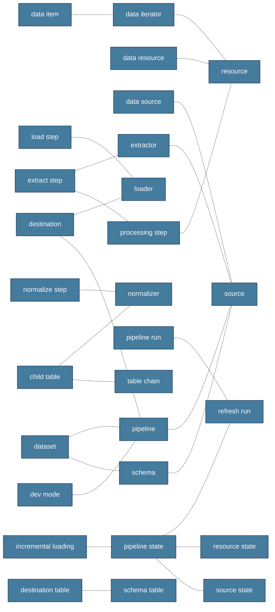
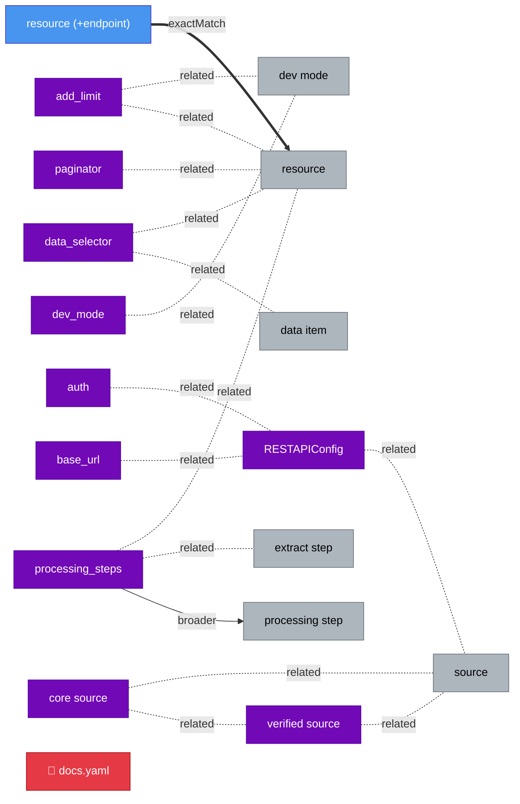

# dlt Vocabulary Diagrams

> Auto-generated from `.vocabulary/vocabulary.skos.ttl` — do not edit manually.
> Regenerate: `uv run python tools/visualize_vocabulary.py`

## 1. Entity Taxonomy

Broader/narrower hierarchy of dlt concepts, grouped by collection.

```mermaid
graph TD
    classDef topConcept fill:#2d6a4f,stroke:#1b4332,color:#fff
    classDef entity fill:#40916c,stroke:#2d6a4f,color:#fff
    classDef detail fill:#74c69d,stroke:#40916c,color:#000

    subgraph sg_core_entities["Core Entities"]
        data-resource["data resource"]
        data-source["data source"]
        dataset["dataset"]
        destination["destination"]
        pipeline["pipeline"]
        resource["resource"]
        schema["schema"]
        source["source"]
    end

    subgraph sg_data_flow["Data Flow"]
        data-item["data item"]
        data-iterator["data iterator"]
        processing-step["processing step"]
    end

    subgraph sg_load_package["Load Package"]
        load-package["load package"]
        load-package-job["job"]
    end

    subgraph sg_pipeline_components["Pipeline Components"]
        extractor["extractor"]
        loader["loader"]
        normalizer["normalizer"]
    end

    subgraph sg_pipeline_execution["Pipeline Execution"]
        extract-step["extract step"]
        load-step["load step"]
        normalize-step["normalize step"]
        pipeline-run["pipeline run"]
        pipeline-step["pipeline step"]
        run-trace["run trace"]
    end

    subgraph sg_schema["Schema"]
        child-table["child table"]
        column-hint["column hint"]
        hint["hint"]
        schema["schema"]
        schema-column["schema column"]
        schema-table["schema table"]
        schema-version["schema version"]
        table-chain["table chain"]
        table-hint["table hint"]
        write-disposition["write disposition"]
    end

    destination-capabilities["destination capabilities"]
    destination-table["destination table"]
    dev-mode["dev mode"]
    extraction-pipe["extraction pipe"]
    incremental-loading["incremental loading"]
    pipeline-state["pipeline state"]
    refresh-run["refresh run"]
    resource-hint["resource hint"]
    resource-state["resource state"]
    source-configuration["source configuration"]
    source-state["source state"]
    state-version["state version"]
    working-directory["working directory"]

    data-source --> data-resource
    dataset --> destination-table
    destination --> dataset
    destination --> destination-capabilities
    hint --> column-hint
    hint --> table-hint
    load-package --> load-package-job
    pipeline --> pipeline-run
    pipeline --> pipeline-state
    pipeline --> schema
    pipeline --> working-directory
    pipeline-run --> pipeline-step
    pipeline-run --> run-trace
    pipeline-state --> state-version
    pipeline-step --> extract-step
    pipeline-step --> load-step
    pipeline-step --> normalize-step
    resource --> extraction-pipe
    resource --> resource-hint
    resource --> resource-state
    schema --> schema-version
    schema-table --> column-hint
    schema-table --> schema-column
    schema-table --> table-hint
    schema-version --> schema-table
    schema-version --> table-chain
    source --> resource
    source --> source-configuration
    source --> source-state
    table-hint --> write-disposition

    class data-source topConcept
    class dataset topConcept
    class destination topConcept
    class load-package topConcept
    class pipeline topConcept
    class source topConcept
    class hint entity
    class pipeline-run entity
    class pipeline-state entity
    class pipeline-step entity
    class resource entity
    class schema entity
    class schema-table entity
    class schema-version entity
    class table-hint entity
    class column-hint detail
    class data-resource detail
    class destination-capabilities detail
    class destination-table detail
    class extract-step detail
    class extraction-pipe detail
    class load-package-job detail
    class load-step detail
    class normalize-step detail
    class resource-hint detail
    class resource-state detail
    class run-trace detail
    class schema-column detail
    class source-configuration detail
    class source-state detail
    class state-version detail
    class table-chain detail
    class working-directory detail
    class write-disposition detail
```

## 2. Cross-References

Associative (`skos:related`) links between concepts — no hierarchy.

## 3. Collections

Organizational groupings. A concept may belong to multiple collections.

```mermaid
graph LR
    classDef collection fill:#e76f51,stroke:#9c4127,color:#fff
    classDef member fill:#f4a261,stroke:#e76f51,color:#000

    core-entities["Core Entities"]:::collection
    data-flow["Data Flow"]:::collection
    load-package-group["Load Package"]:::collection
    pipeline-components["Pipeline Components"]:::collection
    pipeline-execution["Pipeline Execution"]:::collection
    schema-group["Schema"]:::collection
    workspace-actions["Workspace Actions"]:::collection

    data-resource["data resource"]:::member
    core-entities --> data-resource
    data-source["data source"]:::member
    core-entities --> data-source
    dataset["dataset"]:::member
    core-entities --> dataset
    destination["destination"]:::member
    core-entities --> destination
    pipeline["pipeline"]:::member
    core-entities --> pipeline
    resource["resource"]:::member
    core-entities --> resource
    schema["schema"]:::member
    core-entities --> schema
    source["source"]:::member
    core-entities --> source
    data-item["data item"]:::member
    data-flow --> data-item
    data-iterator["data iterator"]:::member
    data-flow --> data-iterator
    processing-step["processing step"]:::member
    data-flow --> processing-step
    load-package["load package"]:::member
    load-package-group --> load-package
    load-package-job["job"]:::member
    load-package-group --> load-package-job
    extractor["extractor"]:::member
    pipeline-components --> extractor
    loader["loader"]:::member
    pipeline-components --> loader
    normalizer["normalizer"]:::member
    pipeline-components --> normalizer
    extract-step["extract step"]:::member
    pipeline-execution --> extract-step
    load-step["load step"]:::member
    pipeline-execution --> load-step
    normalize-step["normalize step"]:::member
    pipeline-execution --> normalize-step
    pipeline-run["pipeline run"]:::member
    pipeline-execution --> pipeline-run
    pipeline-step["pipeline step"]:::member
    pipeline-execution --> pipeline-step
    run-trace["run trace"]:::member
    pipeline-execution --> run-trace
    child-table["child table"]:::member
    schema-group --> child-table
    column-hint["column hint"]:::member
    schema-group --> column-hint
    hint["hint"]:::member
    schema-group --> hint
    schema-group --> schema
    schema-column["schema column"]:::member
    schema-group --> schema-column
    schema-table["schema table"]:::member
    schema-group --> schema-table
    schema-version["schema version"]:::member
    schema-group --> schema-version
    table-chain["table chain"]:::member
    schema-group --> table-chain
    table-hint["table hint"]:::member
    schema-group --> table-hint
    write-disposition["write disposition"]:::member
    schema-group --> write-disposition
    action-add["add"]:::member
    workspace-actions --> action-add
    action-adjust["adjust"]:::member
    workspace-actions --> action-adjust
    action-create["create"]:::member
    workspace-actions --> action-create
    action-debug["debug"]:::member
    workspace-actions --> action-debug
    action-deploy["deploy"]:::member
    workspace-actions --> action-deploy
    action-find["find"]:::member
    workspace-actions --> action-find
    action-inspect["inspect"]:::member
    workspace-actions --> action-inspect
    action-maintain["maintain"]:::member
    workspace-actions --> action-maintain
    action-run["run"]:::member
    workspace-actions --> action-run
    action-show["show"]:::member
    workspace-actions --> action-show
    action-validate["validate"]:::member
    workspace-actions --> action-validate
```

## 4. Workspace Actions

Canonical action-object pairs for skill naming.

| Action | Valid Objects | Meaning | Deprecated Synonyms |
|--------|-------------|---------|---------------------|
| **add** | resource | Add a component to an existing artifact | — |
| **adjust** | resource | Harden a resource for production (pagination, incremental, limits) | — |
| **annotate** | sources | Map source tables to business concepts | — |
| **create** | pipeline, report, transformation, ontology | Author new code/artifact | build, make, generate |
| **debug** | pipeline, deployment | Inspect traces, load packages, exceptions after a failed/suspect run | — |
| **deploy** | workspace | Push to production runtime | — |
| **find** | source | Discover the right source for a data provider | — |
| **inspect** | pipeline | Examine pipeline state, schema, configuration | — |
| **maintain** | pipeline, dataset, report | Ongoing production monitoring | — |
| **run** | pipeline | Execute pipeline: extract -> normalize -> load | execute, trigger, start |
| **show** | pipeline, dataset, report | Display summary | view |
| **validate** | dataset | Verify schema correctness, data types, row counts, quality after load | — |

## 5. Toolkit Overlay: rest-api-pipeline

How **rest-api-pipeline** extends the base vocabulary.

Legend: 🔵 override (promotes hiddenLabel → altLabel) · 🟣 toolkit term · 🔴 deprecated · ⚪ base concept (context)

