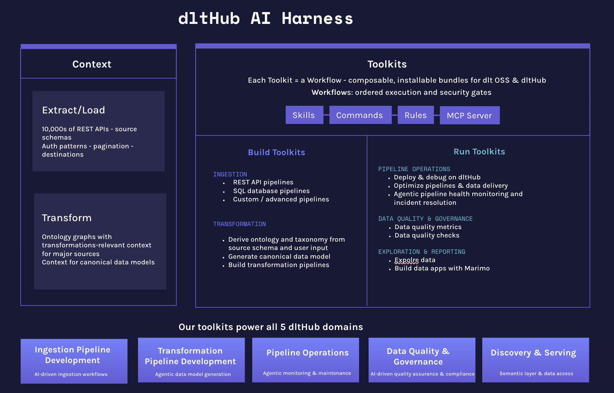
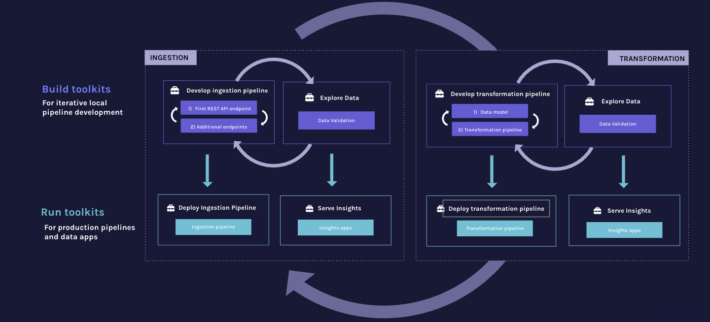
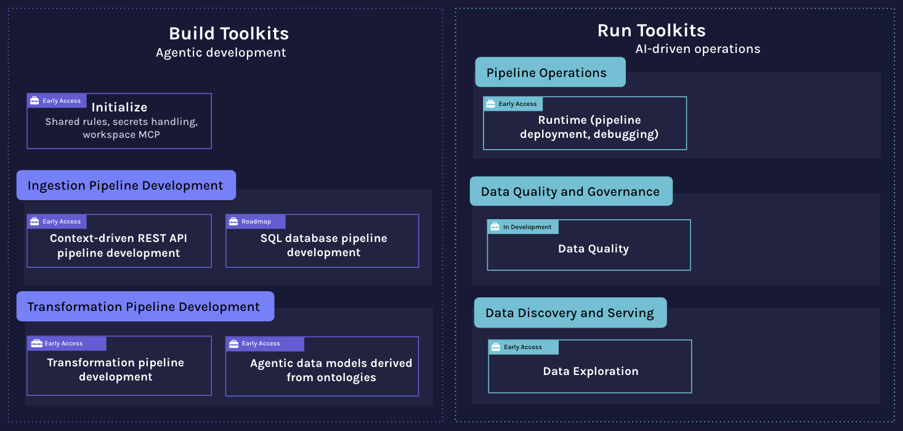

# dltHub AI Workbench

**dlt** (data load tool) is an open-source Python library for loading data from APIs and databases into a warehouse or lakehouse. **dltHub** (paid platform) extends dlt with enterprise-grade features tailored to the needs of coding agents: transformations, data quality validation, managed runtime infrastructure, managed data apps, and an AI-powered workspace environment.



The **dltHub AI Workbench** is a collection of toolkits that give AI coding assistants step-by-step workflows to build data pipelines with dlt. You can use the workbench as-is or fork and customize it for your own stack. The **dlthub ai CLI** installs toolkit components into the right locations for your assistant and runs the workspace MCP server.

**Build** toolkits cover ingestion (REST API, SQL), transformation, and data quality; **Run** toolkits handle deployment and exploration. The REST API toolkit is backed by the [dltHub context](https://dlthub.com/context) — over 9,700 source definitions the agent queries to find verified connectors before writing code. New users can start with the `quick-start` toolkit for a guided end-to-end run from data to dashboard.

The dltHub AI Workbench is tested with **Claude Code**, **Cursor**, and **Codex** and may work with other AI coding assistants. We recommend workings in `accept edits` (Claude) / `--approval-mode` (Codex) mode to review the changes and familiarizing with dlthub AI workflows when getting started with the dlthub AI workbench.

## The dlthub AI workbench supports the iterative data engineering workflow

Building data pipelines is iterative and covers two major phases — ingestion and transformations — each following the same inner loop:

**Build (local development)**
- Develop the pipeline iteratively — for ingestion: first REST API endpoint, then additional endpoints; for transformation: data model first, then the full transformation pipeline
- Explore the loaded data and validate it after each step
- Loop back to refine until the pipeline is solid

**Run (production)**
- Deploy the ingestion or transformation pipeline to production
- Serve insights via data apps built on top of the loaded data

The outer loop connects the two phases: insights from the transformation and serving layer feed back into ingestion refinement. The workbench **Build toolkits** support the local development loop; the **Run toolkits** handle deployment and data apps.



## dltHub AI Workbench Toolkits

The workbench gives your coding assistant **toolkits** — that contain a structured, guided workflow for a specific phase. Instead of generating ad-hoc code, the assistant follows a defined sequence of steps from start to finish. 

A **Toolkit** contains skills, commands, rules, and an MCP server — tied together by a **workflow** that tells the assistant which skill to run at each step and how to leverage the MCP. 

All toolkits depend on `init` for shared rules, secrets handling, and the MCP server. When using the `dlthub ai` CLI, `init` is installed automatically as a dependency. When using the Claude marketplace, install the `init` plugin separately.



### Toolkit components

| Component | What it is | When it runs |
|-----------|-----------|-------------|
| **Skill** | Step-by-step procedure the assistant follows | Triggered by user intent or explicitly with `/skill-name` |
| **Command** | A slash command for a specific action | User invokes with `/toolkit:command` |
| **Rule** | Always-on context (conventions, constraints) | Every session, automatically |
| **Workflow** | Ordered sequence of skills with a fixed entry point | Loaded as a rule — always active |
| **MCP server** | Exposes pipelines, tables, and secrets as tools | During a session, via MCP protocol |
| **[dltHub context](https://dlthub.com/context)** | 9,700+ REST API source definitions with verified connectors and pipeline patterns | During source discovery, via `search_dlthub_sources` |


### MCP tools

Two MCP servers give the agent structured context throughout the workflow to avoid the need for manual copy-pasting.

**dlt-workspace-mcp** (local, installed by `dlthub ai init`) exposes: data inspection tools (`list_tables`, `preview_table`, `execute_sql_query`, `get_row_counts`, `display_schema`, `get_local_pipeline_state`), secrets tools (`secrets_view_redacted`, `secrets_update_fragment`), and toolkit discovery (`list_toolkits`, `toolkit_info`).

**[dltHub context](https://dlthub.com/context)** (remote) provides `search_dlthub_sources` — used by the `find-source` skill to search 9,700+ REST API source definitions and return verified connectors with reference links before writing code.

### Available toolkits

| Toolkit | Phase | Workflow entry | What it does                                                                                                              | Example prompts | Availability |
|---------|-------|---------------|---------------------------------------------------------------------------------------------------------------------------|---------------|--------------|
| `quick-start` | Setup | `quick-start` | Guided end-to-end run from data to dashboard in 3–5 prompts; routes to the right entry skill based on a chosen depth      | *"Use quick-start to take me through the full workflow with the GitHub API"* | Run `/quick-start:quick-start` |
| `bootstrap` | Setup | `/init-workspace` | Checks for `uv`, Python venv, and `dlthub`; installs what's missing; initializes the workspace; then runs `dlthub ai init` and lists available toolkits | *"Run /init-workspace to set up a Python environment with dlthub"* | [Try it out yourself!](https://dlthub.com/docs/dlt-ecosystem/llm-tooling/llm-native-workflow)<br>Run `/init-workspace` |
| `rest-api-pipeline` | Build | `find-source` | Scaffold, debug, and validate REST API ingestion pipelines                                                                | *"Use find-source to load data from the Stripe API into DuckDB"* | [Try it out yourself!](https://dlthub.com/docs/dlt-ecosystem/llm-tooling/llm-native-workflow)<br>Run `/find-source` |
| `sql-database-pipeline` | Build | `find-source` | Scaffold, debug, and validate SQL database ingestion pipelines                                                            | *"Use find-source to load tables from my Postgres database into DuckDB"* | Run `/find-source` |
| `filesystem-pipeline` | Build | `create-filesystem-pipeline` | Load files (CSV, Parquet, JSONL, or custom) from local disk, S3, GCS, Azure, or SFTP into a destination                   | *"Use create-filesystem-pipeline to load my S3 CSV files into DuckDB"* | [Sign up](https://auth.dlthub.com/sign-up) |
| `data-exploration` | Explore | `explore-data` | Query loaded data and create marimo dashboards                                                                            | *"Use explore-data to explore my Stripe pipeline and create a dashboard"* | [Try it out yourself!](https://dlthub.com/docs/dlt-ecosystem/llm-tooling/llm-native-workflow)<br>Run `/explore-data` |
| `dlthub-platform` | Run | `setup-runtime` | Deploy pipelines to the dltHub Platform                                        | *"Use setup-runtime to deploy my pipeline to dltHub"* | [Sign up](https://auth.dlthub.com/sign-up) |
| `transformations` | Transform | `annotate-sources` | Design a Canonical Data Model (CDM) and write dlthub transformation functions from existing pipelines                        | *"Use annotate-sources to start building a CDM from my HubSpot and Luma pipelines"* | [Sign up](https://auth.dlthub.com/sign-up) |
| `data-quality` | Build | `setup-data-quality` | Define, run, and review data quality checks and metrics on dlt pipeline data                                              | *"Use setup-data-quality to add validation checks to my Stripe pipeline"* | [Sign up](https://auth.dlthub.com/sign-up) |

> `init` is a shared dependency that provides rules, secrets handling, and the MCP server. It is installed automatically by `dlthub ai init` or as a separate plugin via the Claude marketplace.


## Getting started

### First-time onboarding (want to try or learn dltHub)

> **`uvx dlthub-start@latest` is ONLY for first-time dlthub users who want to onboard or learn dltHub.** It is an onboarding / playground experience that scaffolds a fresh playground workspace to explore the workbench — it is **not** for production workflows and **not** for setting up an existing project. If you already have a project, or you just want to set up a clean new dlthub project, skip this entirely and use [Set up a project](#set-up-a-project) below. (Coding assistants only suggest this when *you* ask to be onboarded — they never run it for you, because it requires interaction for authentication.)

If you're new to dltHub and want to try or learn it, [`dlthub-start`](https://pypi.org/project/dlthub-start/) is the fastest way in — no prior setup needed. Run it **without a workspace name** and follow the interactive prompts:

```bash
uvx dlthub-start@latest
```

> **Run this yourself in your terminal — don't ask your coding assistant to run it.** `uvx dlthub-start` must be run by a human because it requires interaction for authentication (and prompts you for a workspace name, scaffold, and assistants); it only works in a real terminal. It does **not** work in your assistant's `!` shell mode — run it directly in your own terminal. If you want an agent to set up a clean new project for you, use [`dlthub-init`](#set-up-a-project) instead.

This interactive prompt scaffolds a ready-to-run workspace: asks for a workspace name, picks a scaffold (Starter or Minimal), installs AI workbench files for your coding assistant(s), and runs `uv sync` to install all dependencies. Once done, `cd` into the workspace it created:

```bash
cd <your-workspace-name>
uv run dlthub run load_breweries   # run the example pipeline on dltHub
uv run dlthub show                 # open the dltHub dashboard
```

### Set up a project

To set up a clean new dlthub project, or to add the AI workbench to an existing one.

**Recommended — one command:** [`dlthub-init`](https://pypi.org/project/dlthub-init/) scaffolds AI support, either **in place** or into a **clean new directory**. Unlike `dlthub-start`, it is non-interactive and AI-aware, so your coding assistant can run it for you — this is the command an agent should use to set up a clean new dlthub project. It uses per-file collision handling (merges `pyproject.toml`, never overwrites `secrets.toml`, unions `.gitignore`), pins `dlt[hub]` via a bundled lock, and runs `uv sync`:

```bash
uvx dlthub-init@latest          # set up AI support in the current directory
uvx dlthub-init@latest <dir>    # or scaffold a clean new project into a new directory
```

**Manual steps (fallback):** if you'd rather do it step by step, or `dlthub-init` isn't available:

> **Note:** All `dlthub ai` commands below use `uv run dlthub ...` syntax. If you have `dlthub` installed globally or in an active virtual environment, you can omit `uv run` and call `dlthub` directly. We recommend using uv.

```bash
# Initialize the environment 
uv init 

# Install dlthub
uv add "dlt[hub]"

# Initialize the dlthub workspace and follow its instructions (most importantly `uv sync`)
uv run dlthub init

# Set up AI support (auto-detects your coding assistant)
uv run dlthub ai init

# If multiple coding assistants are detected, specify one explicitly:
uv run dlthub ai init --agent <agent>  # <agent>: claude | cursor | codex
```


`dlthub ai init` detects your coding assistant from environment variables and config files, then installs skills, rules, and the MCP server in the correct locations for that tool.

> **Claude Code note:** Add the following to your `CLAUDE.md` to enforce safe credential handling:
> ```markdown
> CRITICAL: never ask for credentials in chat. Always let the user edit secrets directly and do not attempt to read them.
> ```

> **Cursor note:** After running the command, manually enable the dlt-workspace-mcp server in **Cursor Settings > MCP**. Add the following to your `.cursor/rules/security.mdc` to enforce safe credential handling:
> ```markdown
> CRITICAL: never ask for credentials in chat. Always let the user edit secrets directly and do not attempt to read them.
> ```

> **Codex note:** Codex does not support commands and rules, so the installer converts those into skills and AGENTS.md. Codex also runs in a strict sandbox — consider enabling web access in your project or global config:
> ```toml
> # .codex/config.toml
> web_search = "live"
> ```
> Add the following to your `AGENTS.md` to enforce safe credential handling:
> ```markdown
> CRITICAL: never ask for credentials in chat. Always let the user edit secrets directly and do not attempt to read them.
> ```

### Browse and install toolkits

> **Don't have dlthub set up yet?** Follow [Set up a project](#set-up-a-project) above first (or the `bootstrap` toolkit's `/init-workspace`, which the assistant can drive). The toolkit commands below assume `dlthub` is installed in your environment.


```bash
uv run dlthub ai toolkit list
```

Install toolkits (if you are not sure which toolkits to install we recommend installing all of them):

```bash
uv run dlthub ai toolkit install quick-start
uv run dlthub ai toolkit install bootstrap
uv run dlthub ai toolkit install rest-api-pipeline
uv run dlthub ai toolkit install sql-database-pipeline
uv run dlthub ai toolkit install filesystem-pipeline
uv run dlthub ai toolkit install dlthub-platform
uv run dlthub ai toolkit install data-exploration
uv run dlthub ai toolkit install transformations
uv run dlthub ai toolkit install data-quality
```

### Starting the workbench

Use one of the example prompts from the [Available toolkits](#available-toolkits) table above to kick off a workflow.

**Claude Code** — start a new session via `claude` in your terminal. Restart after installation for skills and MCP to take effect.

**Cursor** — open the project in Cursor and use the chat panel (Cmd+L). The installed skills and rules are picked up automatically.

**Codex** — launch the Codex CLI via `codex` or use the Codex chat in the UI. Restart Codex after setup for the MCP server to take effect.

### Claude Code marketplace plugin (Early Access)

> **Early Access:** The Claude Code plugin is currently in early access and may not provide the best linking experience between different toolkits. If you're new to dltHub and want to try or learn it, see [First-time onboarding](#first-time-onboarding-want-to-try-or-learn-dlthub) — you run `uvx dlthub-start@latest` yourself. The marketplace path below is useful when you want to bootstrap an existing/empty project from inside Claude Code via the `bootstrap` toolkit (which prefers `uvx dlthub-init@latest` — the agent-runnable command for setting up a clean new or existing dlthub project — and falls back to the in-place install steps).

The workbench is also available as a Claude Code plugin via the marketplace. Start a Claude Code session and run:

```
/plugin marketplace add dlt-hub/dlthub-ai-workbench
/plugin install init@dlthub-ai-workbench --scope project
/plugin install quick-start@dlthub-ai-workbench --scope project
/plugin install bootstrap@dlthub-ai-workbench --scope project
/plugin install rest-api-pipeline@dlthub-ai-workbench --scope project
/plugin install sql-database-pipeline@dlthub-ai-workbench --scope project
/plugin install dlthub-platform@dlthub-ai-workbench --scope project
/plugin install data-exploration@dlthub-ai-workbench --scope project
/plugin install transformations@dlthub-ai-workbench --scope project
/plugin install data-quality@dlthub-ai-workbench --scope project
```

Start a new session — plugins take effect only after restarting Claude Code: `claude`

> **Resuming a session?** Plugins installed mid-session are not active until you start a new one.


## The `dlthub ai` CLI

The `dlthub ai` subcommand is the bridge between the workbench and your coding assistant. `dlthub ai init` installs project rules, a secrets management skill, appropriate ignore files, and configures the dlt MCP server for your agent. `dlthub ai toolkit install` copies additional toolkit components (skills, rules, commands) into the right locations for your assistant.

**Toolkit management** — copies skills, rules, commands, and MCP config from the workbench into your project's agent config directory (`.claude/`, `.cursor/`, `.agents/`, etc.):

```bash
uv run dlthub ai status                        # show installed agent, dlthub version, active toolkits
uv run dlthub ai toolkit list                  # list available toolkits from the workbench
uv run dlthub ai toolkit info <name>           # show a toolkit's skills, commands, and workflow
uv run dlthub ai toolkit install <name>        # install a toolkit for the detected agent
uv run dlthub ai toolkit install <name> --agent <agent>  # <agent>: claude | cursor | codex  - override agent detection
```

**Secrets management** — dlt stores credentials in TOML files; these commands let the assistant inspect and update them without reading raw secret values:

```bash
uv run dlthub ai secrets list                  # show which secret files exist and where
uv run dlthub ai secrets view-redacted         # print secrets with values masked
uv run dlthub ai secrets update-fragment --path <file> '<toml>'  # merge a TOML snippet into a secrets file
```

**MCP server** — starts a local server that exposes your dlthub workspace (pipelines, schemas, tables, secrets) as tools the assistant can call:

```bash
uv run dlthub ai mcp run                       # run in SSE mode (default)
uv run dlthub ai mcp run --stdio               # run in stdio mode (for assistants that require it)
uv run dlthub ai mcp install                   # register the MCP server in the agent's config
```

The MCP server allows the assistant to answer questions like "what tables were loaded?" or "show me the schema" without you having to copy-paste output into the chat.

## License

This project is licensed under the [dltHub AI Workbench License](LICENSE).
