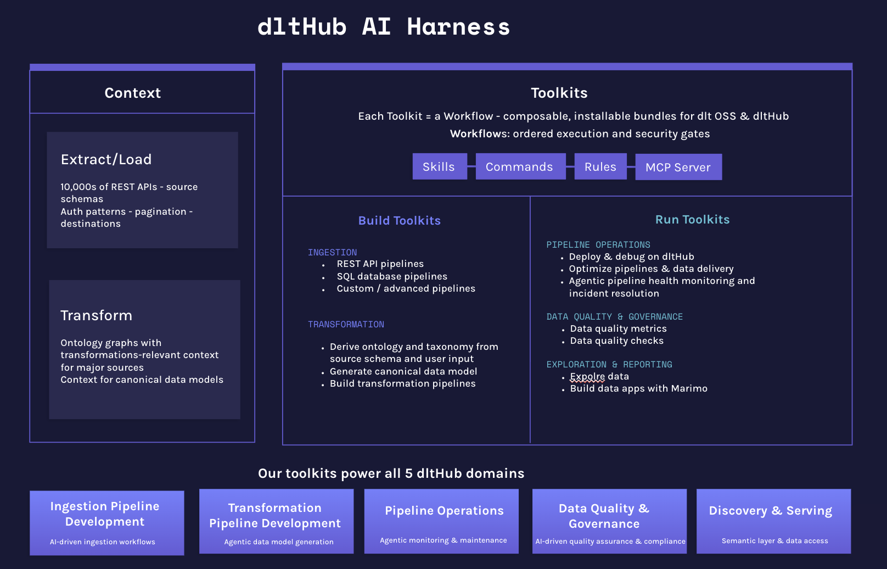
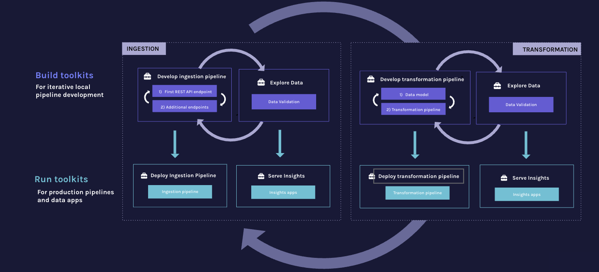
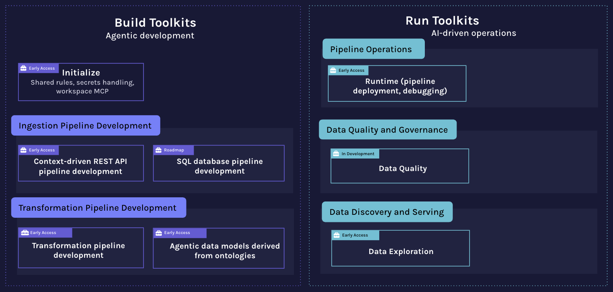

# dltHub AI Harness

**dlt** (data load tool) is an open-source Python library for loading data from APIs and databases into a warehouse or lakehouse. **dltHub** is the paid platform on top of dlt. It adds features for coding agents: transformations, data quality checks, a managed runtime, managed data apps and an AI workspace.



The **dltHub AI Harness** is a collection of toolkits that give AI coding assistants step-by-step workflows to build data pipelines with dlt. You can use the harness as-is or fork and customize it for your own stack. The **`dlthub ai` CLI** installs toolkit components into the right locations for your assistant and runs the workspace MCP server.

**Build** toolkits cover ingestion (REST API, SQL), transformation and data quality. **Run** toolkits cover deployment and exploration. The REST API toolkit is backed by the [dltHub context](https://dlthub.com/context) — over 9,700 source definitions the agent queries to find verified connectors before writing code. New users can start with the `quick-start` toolkit for a guided end-to-end run from data to dashboard.

The dltHub AI Harness is tested with **Claude Code**, **Cursor** and **Codex**. Other AI coding assistants can work too. When you start, use `accept edits` (Claude) or `--approval-mode` (Codex). Then you review each change and learn the dltHub AI workflows.

## The dltHub AI Harness supports the iterative data engineering workflow

Building data pipelines is iterative and covers two major phases: ingestion and transformations. Each phase repeats the same cycle:

**Build (local development)**
- Develop the pipeline iteratively — for ingestion: first REST API endpoint, then additional endpoints; for transformation: data model first, then the full transformation pipeline
- Explore the loaded data and validate it after each step
- Repeat until the pipeline works

**Run (production)**
- Deploy the ingestion or transformation pipeline to production
- Serve insights via data apps built on top of the loaded data

A second cycle connects the two phases: insights from the transformation and serving layer feed back into ingestion. The harness **Build toolkits** support local development. The **Run toolkits** handle deployment and data apps.



## dltHub AI Harness Toolkits

The harness gives your coding assistant **toolkits**. Each toolkit holds a guided workflow for one phase. Instead of generating ad-hoc code, the assistant follows a defined sequence of steps from start to finish.

A **Toolkit** contains skills, commands, rules, agents, and an MCP server — tied together by a **workflow** that tells the assistant which skill to run at each step and how to use the MCP server.

All toolkits depend on `init` for shared rules, secrets handling, and the MCP server. When using the `dlthub ai` CLI, `init` is installed automatically as a dependency. When using the Claude marketplace, install the `init` plugin separately.



### Toolkit components

| Component | What it is | When it runs |
|-----------|-----------|-------------|
| **Skill** | Step-by-step procedure the assistant follows | Triggered by user intent or explicitly with `/skill-name` |
| **Command** | A slash command for a specific action | User invokes with `/toolkit:command` |
| **Rule** | Always-on context (conventions, constraints) | Every session, automatically |
| **Workflow** | Ordered sequence of skills with a fixed entry point | Loaded as a rule — always active |
| **MCP server** | Exposes pipelines, tables, and secrets as tools | During a session, via MCP protocol |
| **Agent** | An agent definition (`AGENT.md`): system prompt, skills, rules, declared access and agent output | Runs unattended: on a schedule, after a job run fails, or on demand |
| **[dltHub context](https://dlthub.com/context)** | 9,700+ REST API source definitions with verified connectors and pipeline patterns | During source discovery, via `search_dlthub_sources` |


### MCP tools

Two MCP servers give the agent context during the workflow. You do not copy and paste output.

**dlt-workspace-mcp** (local, installed by `dlthub ai init`) exposes: data inspection tools (`list_tables`, `preview_table`, `execute_sql_query`, `get_row_counts`, `get_table_schema`, `export_schema`, `get_local_pipeline_state`), secrets tools (`secrets_view_redacted`, `secrets_update_fragment`), and toolkit discovery (`list_toolkits`, `toolkit_info`).

**[dltHub context](https://dlthub.com/context)** (remote) provides `search_dlthub_sources` — used by the `find-source` skill to search 9,700+ REST API source definitions and return verified connectors with reference links before writing code.

### Available toolkits

| Toolkit | Phase | Workflow entry | What it does                                                                                                              | Example prompts | Availability |
|---------|-------|---------------|---------------------------------------------------------------------------------------------------------------------------|---------------|--------------|
| `quick-start` | Setup | `quick-start` | Guided end-to-end run from data to dashboard in 3–5 prompts; routes to the right entry skill based on a chosen depth      | *"Use quick-start to take me through the full workflow with the GitHub API"* | Run `/quick-start:quick-start` |
| `bootstrap` | Setup | `/init-workspace` | Checks for `uv`, Python venv, and `dlthub`; installs what's missing; initializes the workspace; then runs `dlthub ai init` and lists available toolkits | *"Run /init-workspace to set up a Python environment with dlthub"* | [Try it out yourself!](https://dlthub.com/docs/dlt-ecosystem/llm-tooling/llm-native-workflow)<br>Run `/init-workspace` |
| `rest-api-pipeline` | Build | `find-source` | Scaffold, debug, and validate REST API ingestion pipelines                                                                | *"Use find-source to load data from the Stripe API into DuckDB"* | [Try it out yourself!](https://dlthub.com/docs/dlt-ecosystem/llm-tooling/llm-native-workflow)<br>Run `/find-source` |
| `sql-database-pipeline` | Build | `find-source` | Scaffold, debug, and validate SQL database ingestion pipelines                                                            | *"Use find-source to load tables from my Postgres database into DuckDB"* | Run `/find-source` |
| `filesystem-pipeline` | Build | `create-filesystem-pipeline` | Load files (CSV, Parquet, JSONL, or custom) from local disk, S3, GCS, Azure, or SFTP into a destination                   | *"Use create-filesystem-pipeline to load my S3 CSV files into DuckDB"* | [Sign up](https://auth.dlthub.com/sign-up) |
| `data-exploration` | Explore | `explore-data` | Query loaded data and create marimo dashboards                                                                            | *"Use explore-data to explore my Stripe pipeline and create a dashboard"* | [Try it out yourself!](https://dlthub.com/docs/dlt-ecosystem/llm-tooling/llm-native-workflow)<br>Run `/explore-data` |
| `dlthub-platform` | Run | `setup-runtime` | Deploy pipelines to the dltHub Platform                                        | *"Use setup-runtime to deploy my pipeline to dltHub"* | [Sign up](https://auth.dlthub.com/sign-up) |
| `transformations` | Transform | `annotate-sources` | Design a Canonical Data Model (CDM) and write dlthub transformation functions from existing pipelines                        | *"Use annotate-sources to start building a CDM from my HubSpot and Luma pipelines"* | [Sign up](https://auth.dlthub.com/sign-up) |
| `data-quality` | Build | `setup-data-quality` | Define, run, and review data quality checks and metrics on dlt pipeline data                                              | *"Use setup-data-quality to add validation checks to my Stripe pipeline"* | [Sign up](https://auth.dlthub.com/sign-up) |
| `performance` | Build | `optimize-performance` | Tune a slow or memory-heavy pipeline — diagnose the bottleneck stage and apply parallelism, workers, buffers, and batching | *"Use optimize-performance to speed up my Postgres pipeline"* | [Sign up](https://auth.dlthub.com/sign-up) |


## Getting started

### New project (recommended)

To set up a clean new dltHub project with AI support, run [`dlthub-init`](https://pypi.org/project/dlthub-init/). The command is not interactive, so **your coding assistant can run it for you**. Agents must use this command to create a new dltHub project. It pins `dlt[hub]` with a bundled lock and runs `uv sync`:

```bash
uvx dlthub-init@latest <dir>    # scaffold a clean new project into <dir>
```

### Existing project

To add the AI harness to an existing project, run the same [`dlthub-init`](https://pypi.org/project/dlthub-init/) **in place**. It merges `pyproject.toml`, keeps `secrets.toml` and adds missing lines to `.gitignore`. Then it pins `dlt[hub]` and runs `uv sync`. Your coding assistant can run it for you:

```bash
uvx dlthub-init@latest          # set up AI support in the current directory
```

**Manual steps (fallback):** if `dlthub-init` is not available, or you want to do each step yourself:

> **Note:** All `dlthub ai` commands below use `uv run dlthub ...` syntax. If you have `dlthub` installed globally or in an active virtual environment, you can omit `uv run` and call `dlthub` directly. We recommend using uv.

```bash
uv init
uv add "dlt[hub]"

# then run `uv sync` as the output says
uv run dlthub init

# Set up AI support (auto-detects your coding assistant)
uv run dlthub ai init

# If multiple coding assistants are detected, specify one explicitly:
uv run dlthub ai init --agent <agent>  # <agent>: claude | cursor | codex
```


`dlthub ai init` detects your coding assistant from environment variables and config files, then installs skills, rules, and the MCP server in the correct locations for that tool.

> **Claude Code note:** Add the following to your `CLAUDE.md` to enforce safe credential handling:
> ```markdown
> CRITICAL: never ask for credentials in chat. Always let the user edit secrets directly and do not attempt to read them.
> ```

> **Cursor note:** After running the command, manually enable the dlt-workspace-mcp server in **Cursor Settings > MCP**. Add the following to your `.cursor/rules/security.mdc` to enforce safe credential handling:
> ```markdown
> CRITICAL: never ask for credentials in chat. Always let the user edit secrets directly and do not attempt to read them.
> ```

> **Codex note:** Codex does not support commands and rules, so the installer converts those into skills and AGENTS.md. Codex also runs in a strict sandbox — consider enabling web access in your project or global config:
> ```toml
> # .codex/config.toml
> web_search = "live"
> ```
> Add the following to your `AGENTS.md` to enforce safe credential handling:
> ```markdown
> CRITICAL: never ask for credentials in chat. Always let the user edit secrets directly and do not attempt to read them.
> ```

### First-time onboarding (want to try or learn dltHub)

If you are new to dltHub, run [`dlthub-start`](https://pypi.org/project/dlthub-start/) **yourself**. It creates a **playground** workspace. Do not use it for production or for a real project:

```bash
uvx dlthub-start@latest
```

> **Run this command yourself, not with your coding assistant.** It asks for authentication, so it works only in a real terminal (not in `!` mode). For agent-driven setup, use [`dlthub-init`](#new-project-recommended) above.

### Browse and install toolkits

> **If `dlthub` is not installed**, do [New project](#new-project-recommended) or [Existing project](#existing-project) first. The `bootstrap` toolkit's `/init-workspace` also works. The toolkit commands below need `dlthub` in your environment.


```bash
uv run dlthub ai toolkit list
```

If you are not sure which toolkits you need, install all of them:

```bash
uv run dlthub ai toolkit install quick-start
uv run dlthub ai toolkit install bootstrap
uv run dlthub ai toolkit install rest-api-pipeline
uv run dlthub ai toolkit install sql-database-pipeline
uv run dlthub ai toolkit install filesystem-pipeline
uv run dlthub ai toolkit install dlthub-platform
uv run dlthub ai toolkit install data-exploration
uv run dlthub ai toolkit install transformations
uv run dlthub ai toolkit install data-quality
uv run dlthub ai toolkit install performance
```

### Starting the harness

Use one of the example prompts from the [Available toolkits](#available-toolkits) table above to kick off a workflow.

**Claude Code** — start a new session via `claude` in your terminal. Restart after installation for skills and MCP to take effect.

**Cursor** — open the project in Cursor and use the chat panel (Cmd+L). The installed skills and rules are picked up automatically.

**Codex** — launch the Codex CLI via `codex` or use the Codex chat in the UI. Restart Codex after setup for the MCP server to take effect.

### Claude Code marketplace plugin (Early Access)

> **Early Access:** The Claude Code plugin does not link toolkits as well as `dlthub ai toolkit install`. To try dltHub for the first time, use [First-time onboarding](#first-time-onboarding-want-to-try-or-learn-dlthub). The plugin path is for a project you set up from inside Claude Code with the `bootstrap` toolkit.

The harness is also available as a Claude Code plugin via the marketplace. Start a Claude Code session and run:

```
/plugin marketplace add dlt-hub/dlthub-ai-harness
/plugin install init@dlthub-ai-harness --scope project
/plugin install quick-start@dlthub-ai-harness --scope project
/plugin install bootstrap@dlthub-ai-harness --scope project
/plugin install rest-api-pipeline@dlthub-ai-harness --scope project
/plugin install sql-database-pipeline@dlthub-ai-harness --scope project
/plugin install filesystem-pipeline@dlthub-ai-harness --scope project
/plugin install dlthub-platform@dlthub-ai-harness --scope project
/plugin install data-exploration@dlthub-ai-harness --scope project
/plugin install transformations@dlthub-ai-harness --scope project
/plugin install data-quality@dlthub-ai-harness --scope project
/plugin install performance@dlthub-ai-harness --scope project
```

Plugins become active only in a new session. Restart Claude Code with `claude`.


## The `dlthub ai` CLI

The `dlthub ai` subcommand is the bridge between the harness and your coding assistant. `dlthub ai init` installs project rules, a secrets skill and ignore files. It also configures the dlt MCP server for your agent. `dlthub ai toolkit install` copies additional toolkit components (skills, rules, commands) into the right locations for your assistant.

**Toolkit management** — copies skills, rules, commands, and MCP config from the harness into your project's agent config directory (`.claude/`, `.cursor/`, `.agents/`, etc.):

```bash
uv run dlthub ai status                        # show dlt version, agent, installed toolkits, readiness checks
uv run dlthub ai toolkit list                  # list available toolkits from the harness
uv run dlthub ai toolkit info <name>           # show a toolkit's skills, commands, and workflow
uv run dlthub ai toolkit install <name>        # install a toolkit for the detected agent
uv run dlthub ai toolkit install <name> --agent <agent>  # <agent>: claude | cursor | codex  - override agent detection
```

**Secrets management** — dlt stores credentials in TOML files; these commands let the assistant inspect and update them without reading raw secret values:

```bash
uv run dlthub ai secrets list                  # show which secret files exist and where
uv run dlthub ai secrets view-redacted         # print secrets with values masked
uv run dlthub ai secrets update-fragment --path <file> '<toml>'  # merge a TOML snippet into a secrets file
```

**MCP server** — starts a local server that exposes your dlthub workspace (pipelines, schemas, tables, secrets) as tools the assistant can call:

```bash
uv run dlthub ai mcp run                       # run with streamable-http (default)
uv run dlthub ai mcp run --sse                 # run with the legacy SSE transport
uv run dlthub ai mcp run --stdio               # run in stdio mode (for assistants that require it)
uv run dlthub ai mcp install                   # register the MCP server in the agent's config
```

With the MCP server, the assistant can answer questions like "what tables were loaded?" or "show me the schema". You do not paste output into the chat.

## License

This project is licensed under the [dltHub AI Harness License](LICENSE).
