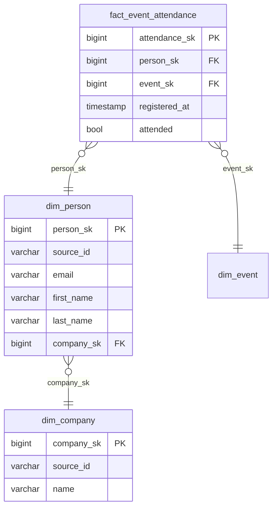

# Generate CDM

Translate the ontology into an implementation-ready Canonical Data Model using Kimball dimensional modeling.

**Requires** `.schema/<cdm-name>/ontology.md` from `create-ontology`.
If missing, run `create-ontology` first.

Determine `<cdm-name>` from the file path of `ontology.md` (the parent directory name) or from session context.

Reference: Kimball dimensional modeling — https://www.kimballgroup.com/data-warehouse-business-intelligence-resources/kimball-techniques/dimensional-modeling-techniques/

## Steps

### 1. Classify entities as fact or dimension

Read `.schema/<cdm-name>/ontology.md`. For each entity in the file, apply Kimball classification using the entity description, attributes, and relationships:

| Signals | Classification |
|---|---|
| Describes a business event or transaction (e.g. EventAttendance, Order, PageView) | **Fact table** |
| Describes a stable business object (e.g. Person, Company, Product) | **Dimension table** |
| A dimension table shared across multiple fact tables | **Conformed dimension** |

Present the classification to the user and confirm before proceeding:

```
Here's how I'd structure your data model:

  Dimension tables (who/what your data is about):
    dim_person — Person (conformed — shared across all facts)
    dim_company — Company (conformed — shared across all facts)
    dim_event — Event

  Fact tables (the events/transactions):
    fact_event_attendance — one row per person per event attended

Does this look right?
```

Agree on **conformed dimensions** early — they must be consistent across all fact tables.

### 2. Define grain for every fact table

For each fact table, write an explicit grain statement:
> "One row per **[unit]** per **[unit]**"

Example: "One row per person per event attended."

The grain drives which columns go in the fact table vs. a dimension, the grain key, and the surrogate key definition. Never proceed without a confirmed grain.

### 3. Design dimension tables

For each dimension entity:
- Add a **surrogate key** (`<entity_name>_sk`, bigint)
- Assign **SCD type**:
  - **Type 1** (default): overwrite on change — use for attributes where history doesn't matter
  - **Type 2**: track history — adds `valid_from` (timestamp), `valid_to` (timestamp, nullable), `is_current` (bool)
  - Use Type 2 for: status, tier, segment, role — anything an analyst might want "as of" a date
- Include `source_id` (natural key from source) and `source_pipeline` for lineage
- Null semantics: assign sentinel rows (`UNKNOWN`, `NOT_APPLICABLE`) — **never use NULL as FK** (Kimball Rule #6)

### 4. Design fact tables

For each fact table:
- Reference dimension surrogate keys as FKs (never natural keys in the fact)
- Add a **degenerate dimension** for the natural transaction key if useful (e.g. `event_id`)
- Include additive measures (counts, amounts) and semi-additive measures clearly labelled
- No descriptive attributes — push those to dimensions

### 5. Review entity equivalence

Check for aliases that only become visible at the dimensional modeling stage — e.g. two ontology entities that would produce identical dimension tables. Do **not** re-open concept collapses already confirmed during `annotate-sources`; those are settled.

If a new collapse is warranted, confirm with the user before merging the tables.

### 6. Write CDM

Write `.schema/<cdm-name>/CDM.md`. The file has two parts: a Mermaid ERD for visual review, followed by a per-table spec section that `create-transformation` reads to generate SQL.

````markdown
# CDM: {cdm-name}

> Generated: {date}

## Entity relationship diagram



---

## Tables

### dim_person

**Type:** dimension  
**SCD:** Type 1  
**Surrogate key:** person_sk  
**Conformed:** yes  

| Column | Type | PK | FK | Notes |
|---|---|---|---|---|
| person_sk | bigint | ✓ | | surrogate key |
| source_id | varchar | | | original ID from upstream system |
| source_pipeline | varchar | | | lineage |
| email | varchar | | | natural key |
| first_name | varchar | | | |
| last_name | varchar | | | |
| company_sk | bigint | | dim_company.company_sk | |

### dim_company

**Type:** dimension  
**SCD:** Type 1  
**Surrogate key:** company_sk  
**Conformed:** yes  

| Column | Type | PK | FK | Notes |
|---|---|---|---|---|
| company_sk | bigint | ✓ | | surrogate key |
| source_id | varchar | | | |
| source_pipeline | varchar | | | lineage |
| name | varchar | | | |

### fact_event_attendance

**Type:** fact  
**Grain:** one row per person per event attended  

| Column | Type | PK | FK | Notes |
|---|---|---|---|---|
| attendance_sk | bigint | ✓ | | surrogate key |
| person_sk | bigint | | dim_person.person_sk | |
| event_sk | bigint | | dim_event.event_sk | |
| registered_at | timestamp | | | |
| attended | bool | | | |
````

After writing the file, explicitly ask the user to open and review `.schema/<cdm-name>/CDM.md` before continuing:

```
Please review `.schema/<cdm-name>/CDM.md` — it contains the full data model with all tables, columns, and relationships.

Let me know if anything looks wrong or needs changing before we move on.
```

Wait for explicit confirmation before handing over to `create-transformation` skill.

## Output

- `.schema/<cdm-name>/CDM.md` — Mermaid ERD for visual review + per-table column specs for `create-transformation`

Hand over to `create-transformation` skill.